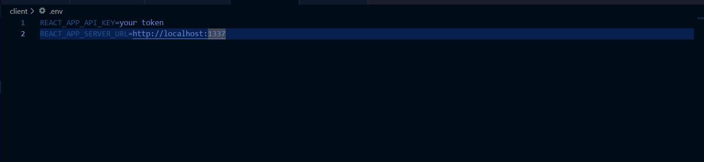

<h1 align="center">ShopSense Ecommerce Project</h1>

ShopSense is a basic ecommerce web store that allows users to browse and purchase products in various categories. It provides a seamless shopping experience with features such as product browsing, cart management, and checkout.

## Features

- Browse Products: Explore a wide range of products available in 7 different categories- Grocery, Fashion, SmartPhones, SmartGadgets, Electronic Appliances, Food & Drinks, Laptops, TVs.
- Product Details: Get detailed information about each product by clicking on its image or title.
- Add to Cart: Add desired products to the cart and specify the quantity.
- Cart Management: View all items in the cart, remove items, or change their quantity.
- Seamless Navigation: Clicking on a product image redirects to its dedicated product page.
- Secure Checkout: Complete the purchase process by providing billing and card details.
- Strapi CMS: Utilizes Strapi as the API and CMS for managing product data.
- Tech Stack used: Project is mainly built using React Js. Whole Page is divided into different components for Home, Cart, Category, Product etc. Product Data is stored and displayed using Strapi CMS. Payment information is static and not dynamic (not stored anywhere)

## Installation

### Prerequisites

Before you begin, ensure that you have the following software installed on your system:

- Node.js (version >= 14.x)
- npm (Node Package Manager) or yarn
- SQLite (depending on your database choice for Strapi)

To run the ShopSense Ecommerce Project locally, follow these steps:

### Client

1. Navigate to the client folder: `cd client`
2. Install dependencies: `npm install`
3. Start the client development server: `npm start`
4. Open your browser and visit `http://localhost:3000`

The client will be running on port 3000 and will fetch content from the API.

### Set up the Strapi CMS

1. Navigate to the api folder: `cd api`
2. Install the CMS dependencies by running the following command: `npm install`
(Keep the setting default while installing the CMS)
3. Build the CMS application: `npm build`
3. Start the Strapi CMS server: `npm run develop`

The API server will be running and serving data to the client.

### Accessing the Application
1. - The React.js client can be accessed at http://localhost:3000.
   - The Strapi CMS can be accessed at http://localhost:1337.
2. For proper functioning of Strapi, go to http://localhost:1337 and follow instructions to login and get access to admin dashboard
3. You would need to generate an API token (needed for fetching data) from `settings -> Api Tokens`. Create a new API token or you can enter this `5af45864a8bb8871009ca785f555fd18c6a2f19f6b77b3a9ce9a55c2ec60012a83d7863e4c06d4357c4a5e3acf69bdfd2f72ea050838f8547ee5d0c6a44a49746c8ce5d61dd9cdf12c5ce802186f6410027c1deeb326ad798a46c4546b908e059917b0710d9f1b26f948a355b521304a9305196f8712ba1ff21b652d9535bc7b`

4. After generating the API token, head to client folder and create a `.env` file. Your .env file should look like this:

5. Set these two values `REACT_APP_SERVER_URL=http://localhost:1337`, `REACT_APP_API_KEY=Enter_API_Token_Generated_here` and restart both client and api and you would be able to see the project locally at http://localhost:3000.

Make sure to start both the client and API servers concurrently to enable full functionality of the ShopSense Ecommerce Project.

In case of any issues while installing, you can contact me.

## Screenshots/Demo

You can watch the demo for website [here](https://clipchamp.com/watch/9vwDxLtP25g)

- **HomePage for the website**
  

- **Category Section: You can checkout products from 7 different categories**
  

- **By clicking on category, you will land on specific category page displaying all products under it**

- **Popular Products under Category here**
  

- **Click on product to read more about product details or add it to cart**
  

- **Add product to your cart by clicking on add to cart button. Also don't forget to select the quantity**

- **You can also search for any product you want**
  

- **You can see all your products at one place in shopping cart and head for checkout**
  

- **Checkout page will look like**
  

- **Confirmation for Order placed**
  

- **Newsletter/Footer Section**
  

- **Strapi Api acting as CMS for this website**

## License
This is a personal ecommerce project, not for commercial use. The design is original, and any resemblance is unintentional and I apologize for the same.
