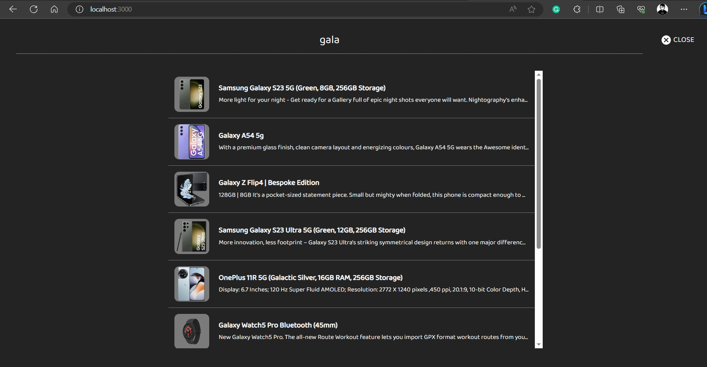

# ShopSense Ecommerce Project

ShopSense is a basic ecommerce web store that allows users to browse and purchase products in various categories. It provides a seamless shopping experience with features such as product browsing, cart management, and checkout.

## Features

- Browse Products: Explore a wide range of products available in 7 different categories- Grocery, Fashion, SmartPhones, SmartGadgets, Electronic Appliances, Food & Drinks, Laptops, TVs.
- Product Details: Get detailed information about each product by clicking on its image or title.
- Add to Cart: Add desired products to the cart and specify the quantity.
- Cart Management: View all items in the cart, remove items, or change their quantity.
- Seamless Navigation: Clicking on a product image redirects to its dedicated product page.
- Secure Checkout: Complete the purchase process by providing billing and card details.
- Strapi CMS: Utilizes Strapi as the API and CMS for managing product data.
- Tech Stack used: Project is mainly built using React Js. Whole Page is divided into different components for Home, Cart, Category, Product etc. Product Data is stored and displayed using Strapi CMS. Payment information is static and not dynamic (not stored anywhere)

## Installation

To run the ShopSense Ecommerce Project locally, follow these steps:

### Client

1. Navigate to the client folder: `cd client`
2. Install dependencies: `npm install`
3. Start the client development server: `npm start`
4. Open your browser and visit `http://localhost:3000`

The client will be running on port 3000 and will fetch content from the API.

### API

1. Navigate to the api folder: `cd api`
2. Install dependencies: `npm install`
3. Start the API server: `npm start`

The API server will be running and serving data to the client.

Make sure to start both the client and API servers concurrently to enable full functionality of the ShopSense Ecommerce Project.

## Screenshots/Demo

- **HomePage for the website**
  

- **Category Section: You can checkout products from 7 different categories**
  

- **By clicking on category, you will land on specific category page displaying all products under it**

- **Popular Products under Category here**
  

- **Click on product to read more about product details or add it to cart**
  

- **Add product to your cart by clicking on add to cart button. Also don't forget to select the quantity**

- **You can also search for any product you want**
  

- **You can see all your products at one place in shopping cart and head for checkout**
  

- **Checkout page will look like**
  

- **Confirmation for Order placed**
  

- **Newsletter/Footer Section**
  

- **Strapi Api acting as CMS for this website**

## License
This is a personal ecommerce project, not for commercial use. The design is original, and any resemblance is unintentional and I apologize for the same.
